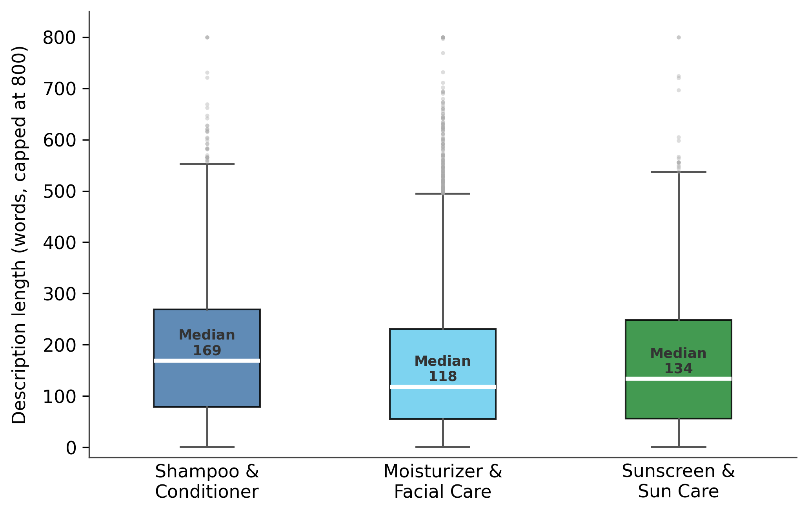
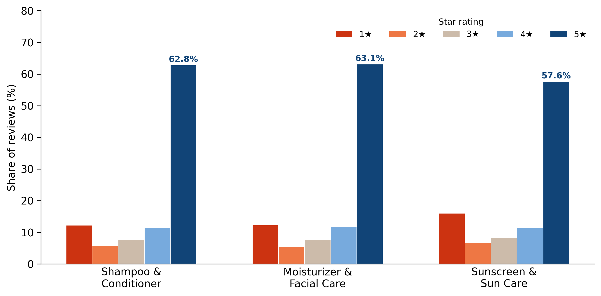
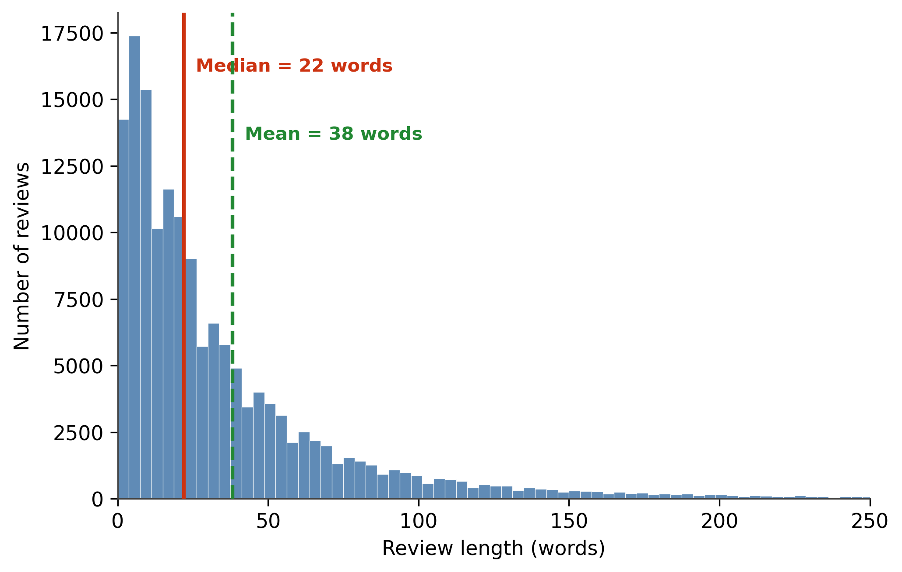

# How Attribute Alignment Between Seller Descriptions and Consumer Reviews Shapes Satisfaction

**MACS 30200 — Research Design | Yanran Qiu | University of Chicago**

## Background

Online product descriptions and consumer reviews are two distinct but interconnected content types in e-commerce. Sellers craft descriptions to highlight product attributes; consumers evaluate those attributes post-purchase and write reviews. Drawing on **Expectation Confirmation Theory** (ECT; Oliver, 1980), this project argues that seller emphasis on a product attribute raises consumers' pre-purchase expectations on that dimension — and that when reality falls short, negative disconfirmation suppresses satisfaction.

**Main RQ:** To what extent does the alignment between seller-emphasized product attributes and consumer-valued attributes shape consumer satisfaction?

- **Sub-RQ1:** To what extent do seller-emphasized attributes align with consumer-valued attributes?
- **Sub-RQ2:** How does attribute alignment (or disalignment) affect consumer satisfaction?

## Data

**Amazon Reviews 2023** ([McAuley Lab, UC San Diego](https://amazon-reviews-2023.github.io)), restricted to three `All_Beauty` subcategories:

These subcategories are chosen because they are **experience goods** — attributes cannot be verified before purchase — making consumers uniquely reliant on seller descriptions. Descriptions in these categories also contain specific, evaluable claims (ingredient actives, SPF values, moisture levels) that map directly to reviewable dimensions. The analytic sample retains only products with non-empty seller descriptions.

| Subcategory | Products | Reviews |
|---|---|---|
| Shampoo & Conditioner | 2,754 | 28,974 |
| Moisturizer & Facial Care | 4,538 | 47,543 |
| Sunscreen & Sun Care | 846 | 7,570 |
| **Total** | **8,138** | **84,087** |

> Raw data files are not included in this repository due to size. Download from the McAuley Lab link above.

## Methods

The analytical pipeline has four steps:

**Step 1 — Attribute extraction (BERTopic)**
Product descriptions and review texts are preprocessed independently (tokenization, lemmatization via spaCy, stopword removal). Two separate BERTopic models are fitted per subcategory — one on the seller description corpus, one on the review corpus — to produce a seller attribute set and a consumer attribute set. Topics are manually reviewed and labeled.

**Step 2 — Alignment score (Sub-RQ1)**
Attribute-set overlap is quantified with the **Jaccard similarity coefficient**:

$$\text{Alignment Score}_p = \frac{|S_p \cap C_p|}{|S_p \cup C_p|}$$

where $S_p$ = seller attribute set and $C_p$ = consumer attribute set for product $p$.

**Step 3 — Attribute satisfaction (ABSA)**
The dependent variable is a continuous sentiment score $\in [-1, +1]$ toward each specific attribute mentioned in a review, extracted via the five-stage aspect-based sentiment analysis (ABSA) pipeline of Nandal et al. (2020): preprocessing → aspect term identification (dependency parsing) → opinion term extraction → bipolar word adjustment → sentiment scoring.

**Step 4 — Regression (Sub-RQ2)**
The unit of analysis is a **review–attribute pair**. `Attribute_Expectation = 1` if the attribute's topic weight in the product description exceeds the 75th-percentile threshold; 0 otherwise. The estimating equation is:

$$\text{Attribute\_Satisfaction}_{ipk} = \beta_0 + \beta_1\,\text{Attribute\_Expectation}_{pk} + \mathbf{X}_{ip}^\top \gamma + \varepsilon_{ipk}$$

Controls $\mathbf{X}_{ip}$ follow Engler et al. (2015): previous product rating, product price, brand reputation, and number of prior reviews. A negative $\hat{\beta}_1$ is consistent with the ECT negative disconfirmation mechanism.

## EDA Results

### Result 1 — Description Coverage



Description length varies across subcategories, with medians of **169 words** (Shampoo & Conditioner), **118 words** (Moisturizer & Facial Care), and **134 words** (Sunscreen & Sun Care). Descriptions of this length are substantive enough to contain multiple distinct attribute claims, confirming that BERTopic can extract meaningful seller attribute sets from the corpus — a prerequisite for measuring seller–consumer alignment in Sub-RQ1.

### Result 2 — Star Rating Distribution



Star ratings are heavily concentrated at 5 stars across all subcategories — **64.5%** for Shampoo & Conditioner, **58.9%** for Moisturizer & Facial Care, and **56.0%** for Sunscreen & Sun Care. This positive skew, driven by self-selection among reviewers, compresses variance to the point where aggregate ratings cannot detect attribute-level disconfirmation effects, directly motivating the use of ABSA scores ∈ [−1, +1] as the outcome measure for Sub-RQ2.

### Result 3 — Review Length Distribution



Review text length is right-skewed with a median of **22 words** and a mean of **38 words**, indicating that most consumers write concise, focused evaluations rather than comprehensive assessments. At this length, reviews reliably contain at least one evaluable attribute–sentiment pair, confirming that the ABSA pipeline can extract attribute-level satisfaction signals from the corpus at scale to operationalize the outcome variable in Sub-RQ2.


## Repository Structure

```
macs30200_online_review/
├── Data_analysis.ipynb       # Full pipeline: data prep and EDA
├── Visualizations/
│   ├── fig1_description_coverage.png
│   ├── fig2_desc_length.png
│   ├── fig3_rating_distribution.png
│   └── fig4_review_length.png
└── README.md
```

## References

- Oliver, R. L. (1980). A cognitive model of the antecedents and consequences of satisfaction decisions. *Journal of Marketing Research*, 17(4), 460–469.
- Engler, T. H., Winter, P., & Schulz, M. (2015). Understanding online product ratings: A customer satisfaction model. *Journal of Retailing and Consumer Services*, 27, 113–120.
- Hou, Y., Li, J., He, Z., Yan, A., Chen, X., & McAuley, J. (2024). Bridging language and items for retrieval and recommendation. arXiv:2403.03952.
- Grootendorst, M. (2022). BERTopic: Neural topic modeling with a class-based TF-IDF procedure. arXiv:2203.05794.
- Nandal, N., Tanwar, R., & Pruthi, J. (2020). Machine learning based aspect level sentiment analysis for Amazon products. *Spatial Information Research*, 28(5), 601–607.
- Kolomoyets, Y. & Dickinger, A. (2023). Understanding value perceptions and propositions: A machine learning approach. *Journal of Business Research*, 154, 113355.
