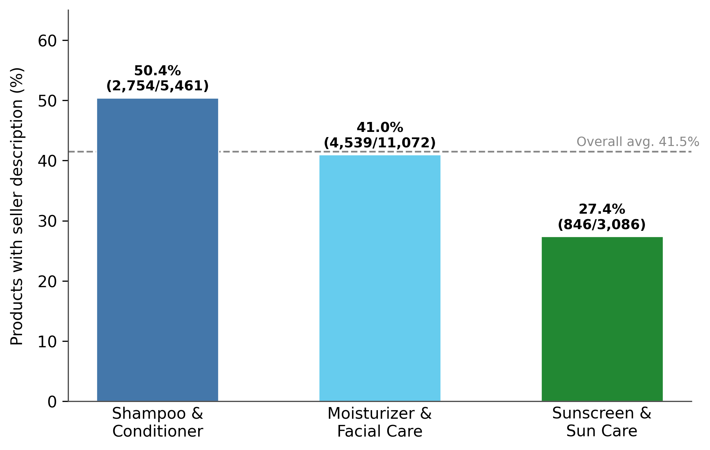

# The Expectation Gap: How Seller-Generated Attribute Claims Shape Consumer Satisfaction in Online Reviews

**MACS 30200 — Research Design | Yanran Qiu | University of Chicago**

## Background

Online product descriptions and consumer reviews are two distinct but interconnected content types in e-commerce. Sellers craft descriptions to highlight attributes that competitively differentiate their products; consumers evaluate those attributes post-purchase and write reviews. This dynamic creates a structural asymmetry: sellers and consumers engage with the same product from fundamentally different positions, producing systematic divergence in which attributes each party foregrounds. This asymmetry is most consequential for **experience goods** — products whose quality can only be assessed through consumption rather than pre-purchase inspection (Nelson, 1970; Darby & Karni, 1973) — where consumers are particularly reliant on seller-provided signals when forming pre-purchase beliefs.

Drawing on **Expectation Confirmation Theory** (ECT; Oliver, 1980), this project argues that seller emphasis on a product attribute raises consumers' pre-purchase expectations on that dimension — and that when reality falls short, negative disconfirmation suppresses attribute-level satisfaction. Existing ECT research has been applied exclusively at the product level using aggregate signals such as price and prior average ratings. This project extends ECT to the **attribute level**, testing whether specific seller claims function as discrete expectation anchors whose disconfirmation drives satisfaction outcomes along individual product dimensions.

**Main RQ:** To what extent does the alignment between seller-emphasized product attributes and consumer-valued attributes shape consumer satisfaction?

- **Sub-RQ1:** To what extent do seller-emphasized attributes align with consumer-valued attributes?
- **Sub-RQ2:** How does attribute alignment (or disalignment) affect consumer satisfaction at the attribute level?

### Hypotheses

- **H1:** Seller-emphasized and consumer-valued attributes will show moderate overlap, reflecting a shared topic space but systematically different emphasis priorities.
- **H2:** Alignment will be higher for subcategories with more immediately observable attributes, as sellers and consumers are more likely to converge on the same verifiable dimensions.
- **H3:** Seller-emphasized attributes will receive lower attribute-level satisfaction scores than non-emphasized attributes, consistent with negative disconfirmation under ECT.
- **H4:** The disconfirmation effect will be stronger in subcategories where attribute performance is immediately verifiable, because raised expectations are quickly evaluated against direct experience.

## Data

**Amazon Reviews 2023** ([McAuley Lab, UC San Diego](https://amazon-reviews-2023.github.io)), restricted to three `All_Beauty` subcategories.

These subcategories are chosen because they are **experience goods** — attributes cannot be verified before purchase — making consumers uniquely reliant on seller descriptions. Descriptions in these categories also contain specific, evaluable claims (ingredient actives, SPF values, moisture levels) that map directly to reviewable dimensions. The analytic sample retains only products with non-empty seller descriptions, yielding the following:

| Subcategory | Products | Reviews |
|---|---|---|
| Shampoo & Conditioner | 2,754 | 28,974 |
| Moisturizer & Facial Care | 4,538 | 47,543 |
| Sunscreen & Sun Care | 846 | 7,570 |
| **Total** | **8,138** | **84,087** |

> Raw data files are not included in this repository due to size. Download from the McAuley Lab link above.

## Methods

The analytical pipeline has four steps:

**Step 1 — Attribute extraction (BERTopic)**
Product descriptions and review texts are preprocessed independently (tokenization, lemmatization via spaCy, stopword removal). Two separate BERTopic models are fitted per subcategory — one on the seller description corpus, one on the review corpus — using contextualized SBERT sentence embeddings and HDBSCAN density-based clustering to produce a seller attribute set $S_p$ and a consumer attribute set $C_p$ per product. The corpus unit is the individual sentence rather than the whole document, allowing a single description or review to be associated with multiple distinct attribute topics. Topics are manually reviewed and validated by Amazon Mechanical Turk crowdworkers.

**Step 2 — Alignment score (Sub-RQ1)**
Attribute-set overlap is quantified with the **Jaccard similarity coefficient**:

$$\text{Alignment Score}_p = \frac{|S_p \cap C_p|}{|S_p \cup C_p|}$$

where $S_p$ = seller attribute set and $C_p$ = consumer attribute set for product $p$. Scores are aggregated within subcategories and compared across subcategories to test H1 and H2.

**Step 3 — Attribute satisfaction (ABSA)**
The dependent variable is a continuous sentiment score $\in [-1, +1]$ toward each specific attribute mentioned in a review, extracted via the five-stage aspect-based sentiment analysis (ABSA) pipeline of Nandal et al. (2020): preprocessing → aspect term identification (dependency parsing) → opinion term extraction → bipolar word adjustment → sentiment scoring. The aspect extraction component follows the task formulation of Pontiki et al. (2014).

**Step 4 — Regression (Sub-RQ2)**
The unit of analysis is a **review–attribute pair**. The binary variable `AttributeExpectation` equals 1 if the focal attribute exists in the seller attribute set of the product, and 0 otherwise. The estimating equation is:

$$\text{Attribute\_Satisfaction}_{ipk} = \beta_0 + \beta_1\,\text{Attribute\_Expectation}_{pk} + \mathbf{X}_{ip}^\top \gamma + \varepsilon_{ipk}$$

Controls $\mathbf{X}_{ip}$ follow Engler et al. (2015): previous product rating, product price, brand reputation, and number of prior reviews. Fixed effects are included for subcategory $\times$ attribute type; standard errors are clustered at the product level. A negative $\hat{\beta}_1$ is consistent with the ECT negative disconfirmation mechanism (H3). Heterogeneity in $\hat{\beta}_1$ across subcategories tests H4.

## EDA Results

### Result 1 — Description Coverage and Richness



Description coverage averages 41.5% across subcategories but ranges from 50.4% in Shampoo & Conditioner to 27.4% in Sunscreen & Sun Care. This variation is theoretically informative: sellers in Shampoo & Conditioner, where efficacy attributes are immediately perceivable after use, invest more heavily in description writing than sellers in Sunscreen & Sun Care, where the primary efficacy claim (UV protection) is unobservable during use — a pattern consistent with H2.


Among products with non-empty descriptions, length is right-skewed across all subcategories, with medians of **169 words** (Shampoo & Conditioner), **118 words** (Moisturizer & Facial Care), and **134 words** (Sunscreen & Sun Care). Descriptions of this length are substantive enough to contain multiple distinct attribute claims, confirming that BERTopic can extract meaningful seller attribute sets from the corpus.

### Result 2 — Star Rating Distribution


Star ratings are heavily concentrated at 5 stars across all subcategories, with an overall 5-star share of **62.9%**. This positive skew, driven by purchasing bias and under-reporting bias among voluntary reviewers (Hu et al., 2009), compresses variance to the point where aggregate ratings cannot detect attribute-level disconfirmation effects — directly motivating the use of ABSA scores $\in [-1, +1]$ as the outcome measure for Sub-RQ2.

### Result 3 — Review Length Distribution


Review text length is right-skewed with a median of **22 words** and a mean of **38 words**, indicating that most consumers write concise, focused evaluations. At this length, reviews reliably contain at least one evaluable attribute–sentiment pair, confirming that the ABSA pipeline can extract attribute-level satisfaction signals from the corpus at scale.

## Contributions

1. **Theoretical**: Extends ECT from the product level to the attribute level, providing a framework for understanding how specific seller claims shape satisfaction along discrete product dimensions.
2. **Methodological**: Assembles a novel computational pipeline — combining BERTopic, ABSA, and OLS regression — that operationalizes the disconfirmation mechanism at scale without relying on predefined attribute taxonomies.
3. **Practical**: Findings suggest that product descriptions are not neutral informational tools but expectation-setting instruments whose attribute-specific effects on satisfaction can be self-defeating when claims outpace product performance.

## Proposed Timeline

| Stage | Tasks | Duration |
|---|---|---|
| Months 1–2 | BERTopic modeling and AMT topic validation | ~5 weeks |
| Months 2–3 | ABSA pipeline, Jaccard alignment scores, dataset construction | ~5 weeks |
| Months 3–4 | OLS estimation and robustness checks | ~3 weeks |
| Months 4–5 | Extension analysis (out-of-domain) and write-up | ~4 weeks |

Computational resources are secured via the University of Chicago Research Computing Center (RCC) Midway cluster. The only external cost is Amazon Mechanical Turk annotation fees, estimated at $300–$600.

## Repository Structure

```
macs30200_online_review/
├── Data_analysis.ipynb       # Full pipeline: data prep and EDA
├── Visualizations/
│   ├── fig1_description_coverage.png
│   ├── fig2_desc_length.png
│   ├── fig3_rating_distribution.png
│   └── fig4_review_length.png
└── README.md
```

## References

- Archak, N., Ghose, A., & Ipeirotis, P. G. (2011). Deriving the pricing power of product features by mining consumer reviews. *Management Science*, 57(8), 1485–1509.
- Chevalier, J. A., & Mayzlin, D. (2006). The effect of word of mouth on sales: Online book reviews. *Journal of Marketing Research*, 43(3), 345–354.
- Darby, M. R., & Karni, E. (1973). Free competition and the optimal amount of fraud. *Journal of Law and Economics*, 16(1), 67–88.
- Dellarocas, C. (2003). The digitization of word of mouth: Promise and challenges of online feedback mechanisms. *Management Science*, 49(10), 1407–1424.
- Engler, T. H., Winter, P., & Schulz, M. (2015). Understanding online product ratings: A customer satisfaction model. *Journal of Retailing and Consumer Services*, 27, 113–120.
- Grootendorst, M. (2022). BERTopic: Neural topic modeling with a class-based TF-IDF procedure. arXiv:2203.05794.
- Hou, Y., Li, J., Fu, X., He, Z., Yan, A., Chen, X., & McAuley, J. (2024). Bridging language and items for retrieval and recommendation. arXiv:2403.03952.
- Hu, N., Zhang, J., & Pavlou, P. A. (2009). Overcoming the J-shaped distribution of product reviews. *Communications of the ACM*, 52(10), 144–147.
- Kolomoyets, Y., & Dickinger, A. (2023). Understanding value perceptions and propositions: A machine learning approach. *Journal of Business Research*, 154, 113355.
- Nandal, N., Tanwar, R., & Pruthi, J. (2020). Machine learning based aspect level sentiment analysis for Amazon products. *Spatial Information Research*, 28(5), 601–607.
- Nelson, P. (1970). Information and consumer behavior. *Journal of Political Economy*, 78(2), 311–329.
- Oliver, R. L. (1980). A cognitive model of the antecedents and consequences of satisfaction decisions. *Journal of Marketing Research*, 17(4), 460–469.
- Pavlou, P. A., & Dimoka, A. (2006). The nature and role of feedback text comments in online marketplaces. *Information Systems Research*, 17(4), 392–414.
- Pocchiari, M., Proserpio, D., & Dover, Y. (2025). Online reviews: A literature review and roadmap for future research. *International Journal of Research in Marketing*, 42(2), 275–297.
- Pontiki, M., Galanis, D., Pavlopoulos, J., Papageorgiou, H., Androutsopoulos, I., & Manandhar, S. (2014). SemEval-2014 Task 4: Aspect based sentiment analysis. *Proceedings of SemEval 2014*, 27–35.
- Schiebler, T., Lee, N., & Brodbeck, F. C. (2026). Expectancy-disconfirmation and consumer satisfaction: A meta-analysis. *Journal of the Academy of Marketing Science*, 54(1), 91–112.
